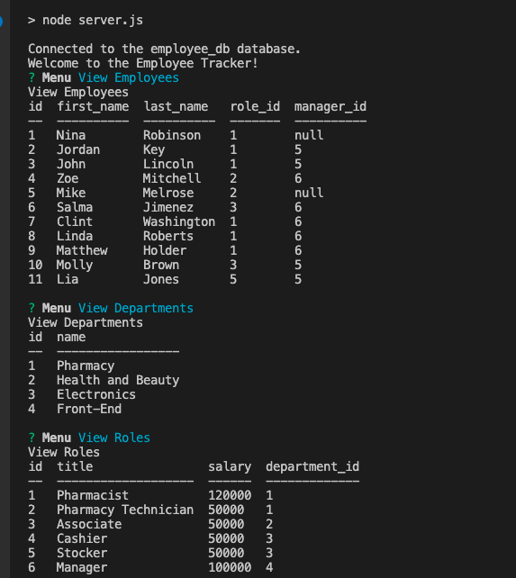
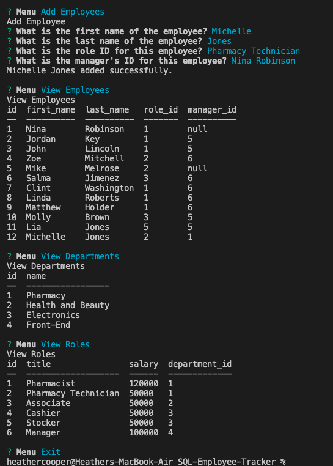

# SQL-Employee-Tracker

## Description

This employee tracker is a command-line application designed to assist a company with management of their employee database, as a content management system (CMS).  This CMS uses Node.js, Inquirer and MySQL.

---
### How to use:
- In the command line, type the following to view the menu of options, and use the `up` and `down` keys to navigate the selections:
 > npm start

---
The schema for this application will contain 3 tables with the following fields:

* Department
  * Department ID
  * Department name
* Role
  * Role ID
  * Title
  * Salary
  * ID
* Employee
  * Employee ID
  * Employee first & last names
  * Employee role ID
  * Manager ID

---

#### __Technology Used__
- Javascript
- SQL
- Node.js
- Inquirer NPM
- MySQL2
- MySQL Workbench
- Console.Table 
  
---

#### __References__
[Inquirer.js](https://www.npmjs.com/package/inquirer)

[MySQL2](https://www.npmjs.com/package/mysql2)

[Console.Table NPM](https://www.npmjs.com/package/console.table)

---

#### __Author__

[Cheribc](https://github.com/cheribc/SQL-Employee-Tracker)

[Link to app demo on YouTube](https://youtu.be/TBvHO8L4K58)

---
#### __License__

[MIT](/Users/heathercooper/Bootcamp/Homework/HWK12/SQL-Employee-Tracker/LICENSE)